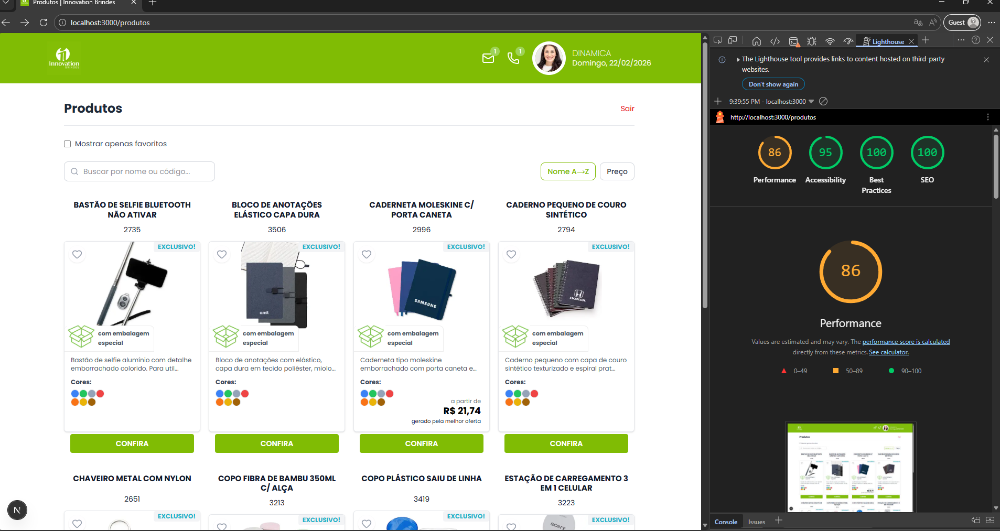

# Innovation Brindes — Frontend Challenge

Aplicação web para listagem de produtos (brindes), com login, favoritos, busca, ordenação e modal de detalhes. Desenvolvida em Next.js (App Router) + TypeScript como desafio front-end.

**Hospedagem (Vercel):** [innovation-brindes-frontend-challen.vercel.app](https://innovation-brindes-frontend-challen.vercel.app)

---

## Funcionalidades implementadas

- **Login** — Autenticação com API, “manter logado” (localStorage + cookie), redirecionamento para `/produtos`
- **Rota protegida** — Middleware que redireciona para `/login` quando não há token (cookie) em `/produtos`
- **Listagem de produtos** — Grid responsivo, busca por nome/código, ordenação por nome e preço
- **Infinite scroll** — Carregamento progressivo (client-side) a partir da lista em cache
- **Favoritos** — Persistência em localStorage e filtro “mostrar apenas favoritos”
- **Modal de detalhes** — Dialog acessível (Headless UI) com foco e teclado (ESC)
- **Performance e acessibilidade** — Ajustes para LCP, `next/image` com `sizes`/priority, skip link, labels e ARIA
- **Docker** — Build multi-stage (standalone) para produção
- **Lighthouse** — Metas de Performance e Acessibilidade documentadas

---

## Stack técnico

- **Next.js 16** (App Router), **TypeScript**, **Tailwind CSS**
- **Zustand** — Estado global (auth, favoritos, modal)
- **React Query (TanStack)** — Cache e requisições da lista de produtos
- **Headless UI** — Dialog do modal
- **Axios** — Cliente HTTP com interceptors (token, 401 → logout)
- **react-hook-form** + **react-toastify** — Formulário de login e notificações

---

## Como rodar com Docker

Recomendado para reproduzir o ambiente de produção (Next.js standalone).

### 1. Build da imagem

```bash
docker build -t innovation-brindes .
```

### 2. Executar o container

```bash
docker run --rm -p 3000:3000 innovation-brindes
```

### 3. Acessar a aplicação

**Local (Docker):**
- **Login:** [http://localhost:3000/login](http://localhost:3000/login)
- **Produtos (após login):** [http://localhost:3000/produtos](http://localhost:3000/produtos)

**Produção (Vercel):** [innovation-brindes-frontend-challen.vercel.app](https://innovation-brindes-frontend-challen.vercel.app) — [Login](https://innovation-brindes-frontend-challen.vercel.app/login) · [Produtos](https://innovation-brindes-frontend-challen.vercel.app/produtos)

### Login para teste (API de homologação)

Use as credenciais abaixo para validar o fluxo com a API:

| Campo    | Valor     |
|----------|-----------|
| Usuário  | `dinamica` |
| Senha    | `123`     |

### Alternativa com Docker Compose

```bash
docker compose up --build
```

O resultado é o mesmo: app em [http://localhost:3000](http://localhost:3000).

---

## Variáveis de ambiente

Não é obrigatório configurar variáveis de ambiente para rodar a aplicação. A API de homologação está fixada no código (cliente Axios). Em produção, convém externalizar a URL da API (por exemplo `NEXT_PUBLIC_API_URL`) e usá-la no cliente.

---

## Arquitetura e decisões técnicas

- **App Router** — Rotas em `app/` com layouts e metadata por rota; `/login` e `/produtos` como páginas principais.
- **React Query** — Estado de servidor da lista de produtos: cache, `staleTime`, retry e `useInfiniteQuery` para “páginas” client-side sobre a lista já carregada.
- **Zustand** — Auth (token, user, `hasHydrated`), favoritos (IDs + persist em localStorage) e estado do modal (produto aberto, foco). Sem Redux para manter o bundle enxuto.
- **Middleware** — Proteção de `/produtos` via cookie `token`; ausência de token redireciona para `/login`.
- **Headless UI Dialog** — Modal de detalhes do produto com foco no botão de fechar, armadilha de foco e fechamento com ESC.
- **Infinite scroll** — A API retorna a lista completa; no cliente a lista é filtrada/ordenada e fatiada em “páginas” (ex.: 8 itens). O scroll usa `IntersectionObserver` no elemento sentinela para carregar a próxima fatia, sem nova requisição.

---

## Pendências e melhorias

- **Testes** — Incluídos testes unitários (Vitest + React Testing Library) e um smoke E2E (Playwright) para o fluxo login → produtos. Veja a seção “Rodando os Testes” abaixo.
- **API sem paginação** — O endpoint de produtos devolve a lista inteira. A paginação é apenas no cliente (slice da lista em cache). Para muitos produtos, o ideal seria paginação ou cursor no backend.
- **Outras limitações** — Token de auth apenas em cookie/localStorage (sem refresh token). Imagem LCP é pré-carregada no layout de `/produtos` quando há cookie; sem cookie o preload não ocorre.

---

## Lighthouse

Resultado do Lighthouse (Desktop) com build de produção. A meta do desafio é Performance e Acessibilidade ≥ 90.



Detalhes do checklist e como reproduzir: [LIGHTHOUSE.md](./LIGHTHOUSE.md).

---

## Scripts locais (sem Docker)

```bash
npm install
npm run dev    # desenvolvimento
npm run build
npm run start  # produção local
```

---

## 🧪 Rodando os Testes

### Testes unitários (Vitest + React Testing Library)

Validam componentes de UI e o formulário de login (chamada à API mockada).

```bash
npm install
npm run test
```

Para rodar com interface interativa: `npm run test:ui`.

### Testes E2E (Playwright)

Um smoke test valida o fluxo **login → redirecionamento para /produtos → exibição do grid de produtos**. As requisições à API são mockadas, então não é necessário backend rodando.

```bash
npx playwright install
npm run test:e2e
```

O Playwright sobe o servidor de desenvolvimento (`npm run dev`) automaticamente antes dos testes.

---

## Deploy

Aplicação publicada na **Vercel:** [innovation-brindes-frontend-challen.vercel.app](https://innovation-brindes-frontend-challen.vercel.app).

O projeto está preparado para deploy em plataformas que suportem Next.js. O build Docker usa `output: "standalone"` para um runtime mínimo. Não inclua credenciais no repositório; use variáveis de ambiente do provedor para API e demais segredos.
